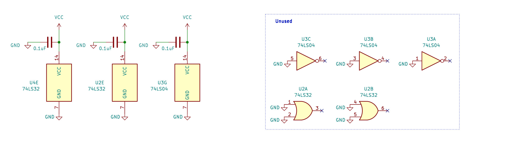

# BeanZee Z80 development board
This project started out as the [Z80 breadboard computer](https://github.com/PainfulDiodes/z80-breadboard-computer/) and the schematic is largely the same. I wanted to move to something more robust and permanent before going on to a more complex design, but I also realised that by building a development board (a little like the Arduino UNO) this could provide a reliable base for experimenting with further designs.

The board has a 10MHz Z80 CPU, a clock module, 32k RAM, 32k EEPROM - which needs to be programmed externally, a simple reset circuit and an FTDI [UM245R](https://ftdichip.com/products/um245r/) USB module.

There is an accompanying [Marvin](https://github.com/PainfulDiodes/marvin) simple monitor program.

Marvin can be used via the USB and a terminal emulator on a host computer to:
* Inspect memory in hex
* Modify memory in hex
* Load a program if available in [Intel HEX](https://en.wikipedia.org/wiki/Intel_HEX) format
* Execute a program (jump to any address)

There are a couple of files that are noteworthy in that they tie Marvin to the circuit design:

* [beanzee.asm](https://github.com/PainfulDiodes/marvin/blob/main/beanzee.asm) defines memory and port addresses
* [UM245R.asm](https://github.com/PainfulDiodes/marvin/blob/main/UM245R.asm) provides basic I/O routines specific for how the UM245 is wired into the circuit - such as which bits relate to the status of the device 

# High level design

For a minimal but usable design I have used an FTDI USB development board. This choice was guided by [Keith's Hackaday project](https://hackaday.io/project/167418-ftdi-usb-cable-problems-with-6850-acia). 

I want to have some software that can run from power-up, which will be preprogrammed onto EEPROM. This will be loaded with a monitor program, and interpreters which will allow other programs to be loaded into RAM and executed from a computer connected via USB.

# Schematics

At the heart of the board is the Z80 CPU. Those control inputs which for our purposes need to remain inactive (/NMI, /INT, /WAIT, /BUSRQ) are wired high. We'll be ignoring some of the control outputs like /BUSAK, which are left disconnected.

For memory I have an [AS6C62256](https://mou.sr/47vSkNy), 32K x 8 SRAM and an [AT28C256](https://mou.sr/47sN0dA) 32K x 8 EEPROM. This makes for a very usable small system, but the simple memory map also keeps the address decoding really simple - device selection based on A15.

I/O decoding is minimal. When operating as a self-contained board, we only have to consider the USB module - from which the CPU reads and writes data on one port (1) and reads status on another port (0). To keep the logic as simple as possible, in effect: port 0 will be read for any even-numbered port, port 1 will be read for any odd-numbered port, and port 1 will be written to for any port number.

However, if we want to connect external I/O, this logic will be insufficient. JP1 allows us to accommodate this. 

With JP1 connecting pins 1 and 2, the board will operate as above - with the USB.

With JP1 connecting pins 2 and 3, the USB will be disabled, and external I/O devices may be connected.

If no jumper is present, an external circuit may be connected to pin 2. Additional external logic may be used for example to enable the USB for a specific port range.

JP2 provides the same options for adding external memory.

The clock module has an input to enable / disable operation. This has been made  accessible as /CLKINH on a socket alongside CLK - see the connectors diagram, below.

If /CLKINH is left disconnected the on-board clock will operate normally. If /CLKINH is taken low the clock will stop, and the clock module output will go into a high impedance state. This means that an external clock generator could be connected to CLK.

The USB module has /TXE (transmit ready) and  /RXF (buffer has data) outputs. To make these accessible to the CPU, I have connected them to the data bus on D0 and D1 via a tri-state buffer. The glue logic then opens the buffer allowing these signals onto the data bus when requested.

Note that the board can be powered via the USB interface.

As a development board, there are a number of connectors for experimentation. Address and data bus connectors, /RD, /WR, /IORQ and /MREQ allow the CPU to address external memory and ports.

# PCB

I designed a double-sided PCB in [KiCAD](https://www.kicad.org/), and had this produced at [JLCPCB](https://jlcpcb.com/).

