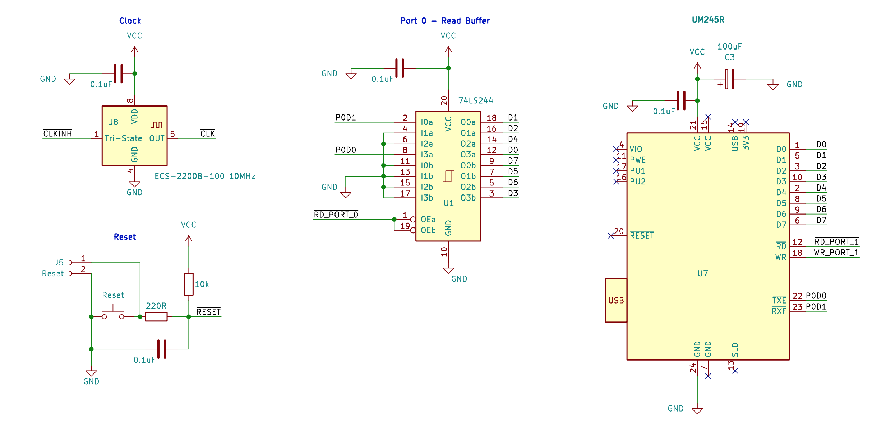

# BeanZee Z80 development board
A small Z80 based single-board-computer designed for experimentation.

Z80 CPU, 10 MHz clock, a simple reset circuit, 32K ROM, 32K RAM, FTDI UM245R USB module and the necessary glue logic.

Connectors provided for interfacing with the Z80: address, data, read, write, IO request, memory request, clock and reset.

The internal clock may be overridden by an external clock, and the internal memory and USB module may also be disabled via jumpers so that external devices can be used, or additional memory and IO selection logic added.

See also:  
[Detailed README](README-DETAILED.md)   

[Hackaday project](https://hackaday.io/project/202193-beanzee)  
[Blog post](https://painfuldiodes.wordpress.com/2024/12/29/beanzee-z80-development-board/)  
[Marvin the monitor](https://github.com/PainfulDiodes/marvin)   
[MINT minimalist interpreter for BeanZee](https://github.com/PainfulDiodes/MINT)  
[Z80 breadboard computer](https://github.com/PainfulDiodes/z80-breadboard-computer) - the schematic is largely the same as BeanZee  

  

  

