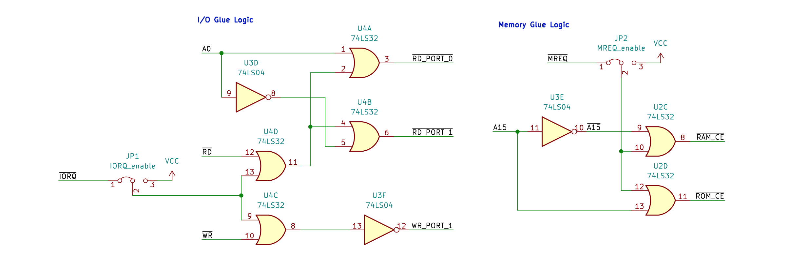
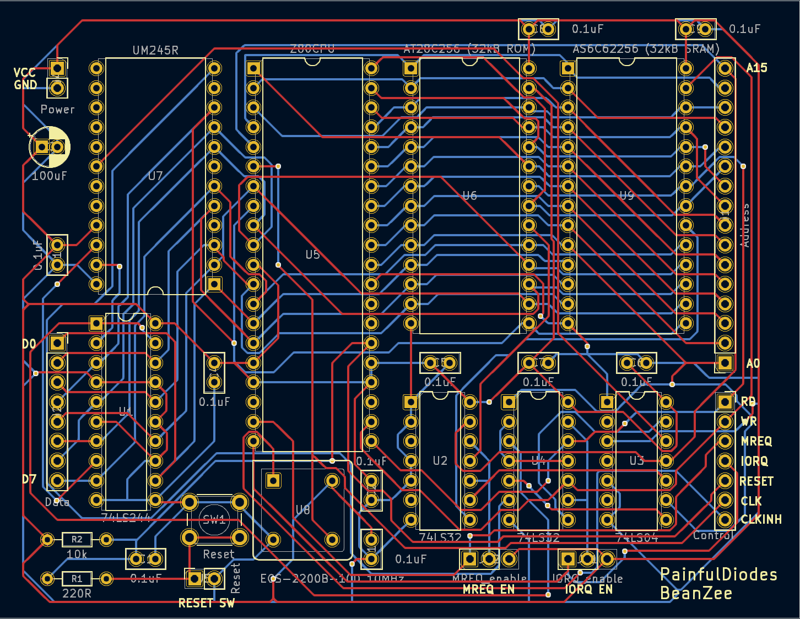

# BeanZee
## Z80 development board
Schematics and Gerber files for a simple development board for the Z80 CPU. 

This started out as a simple [Z80 breadboard computer](https://github.com/PainfulDiodes/z80-breadboard-computer) and the schematic is fundamentally the same; please refer to the breadboard project for further background.

The board has a 10MHz Z80 CPU, a clock module, 32k RAM, 32k EEPROM - which needs to be programmed externally, a simple reset circuit and an [FTDI UM245R](https://ftdichip.com/products/um245r/) USB module.

I am (slowly) developing [Marvin](https://github.com/PainfulDiodes/marvin), a simple monitor program, through which I expect to provide the means to load and execute a program on the BeanZee via the USB interface.

I copied the breadboard design exactly onto a matrixboard prototype, but for the BeanZee PCB design I made several small changes which were intended to allow me to use the board as the basis for further development work:

* Address bus connector  
* Data bus connector  
* Connector for CPU control outputs: /RD,/WR,/IORQ,/MREQ  
* Clock output / input - this normally provides the output from the internal clock module, but by activating a further /CLKINH input, the clock connection can can be used as an input for an external clock source  
* Pin header jumper to disable the internal memory  
* Pin header jumper to disable the internal USB module  
* Support for either 8k (AT28C64B) or 32k (AT28C256) EEPROM  

Schematics:
  

  

