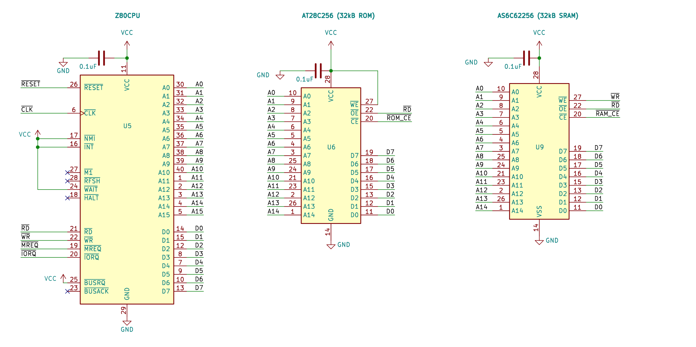
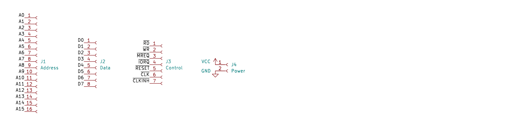

# BeanZee 
Schematics and Gerber files for a simple development board for the Z80 CPU. 

See also:  
[BeanZee Hackaday project](https://hackaday.io/project/202193-beanzee)  
[BeanZee Blog post](https://painfuldiodes.wordpress.com/2024/12/29/beanzee-z80-development-board/)  
[Marvin the monitor for BeanZee](https://github.com/PainfulDiodes/marvin)   
[MINT minimalist interpreter for BeanZee](https://github.com/PainfulDiodes/MINT)  
[Z80 breadboard computer](https://github.com/PainfulDiodes/z80-breadboard-computer) - the schematic is largely the same as BeanZee  

  

  

